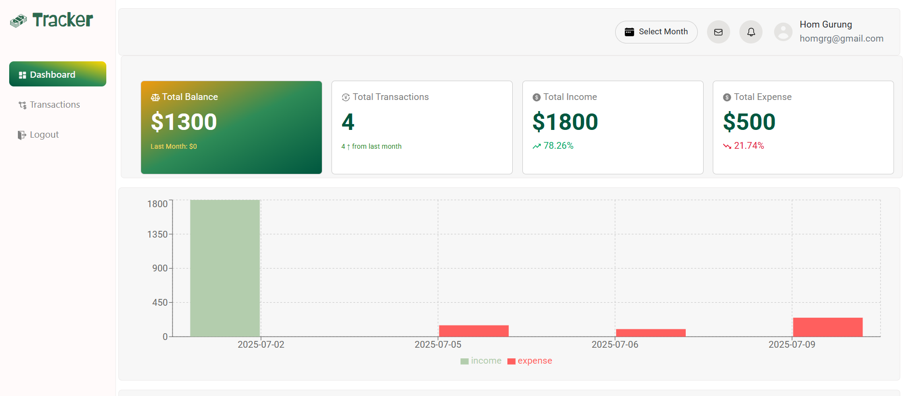
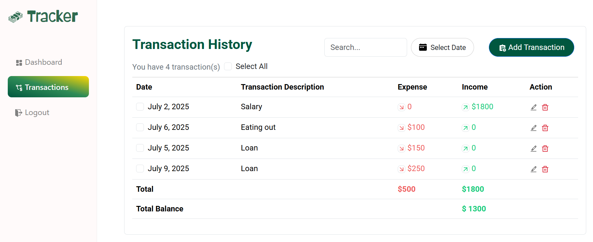

# Track Your Money(Money Tracker)

Welcome to my money tracker repository! This project showcases my full stack development knowledge and comprehensive overview of my work and progress in learning full stack development covering most of the features used in front-end as well as back-end development.




## Table Of Content

- [Introduction](#introduction)
- [Features](#features)
- [Technologies Used ](#technologies-used)
- [Installation](#installation)
- [Usage](#usage)
- [Project Structure](#project-structure)
- [License](#license)
- [Contact](#contact)

## Introduction

This project serves as a resume and project showcase which I can put in my portfolio reflecting my experience and learning as a full stack developer. This project is a full stack application that helps in keeping track of your daily finances. It helps to separate your income and expenses and showcase it in different visual representations.

[Visit Live Demo](https://track-your-money-nine.vercel.app/)

## Features

- **Responsive Design**: Optimized for all devices, including deskops, tablets and mobile phones.

- **Single Page Application**: This application is built using single page application structure.

- **Password hashing using Bcryptjs**: In order to make your password secure, the password you enter is converted into an unreadable string of characters (a hash) using a one-way cryptographic algorithm.

- **JWT Authentication**: The login feature is authenticated and authorized using the JWT authentication in which JSON web token is used to authenticate a valid user. It also allows you to come back to where you left once you close your tab so that you don't have to login again and again unless the web token is expired or you logout.

## Technologies Used

- **Frontend**
  - HTML5
  - CSS3
  - ReactJs
  - React-bootstrap
  - **Packages**
    - react-router
    - react-router-dom
    - react-datepicker
    - react-bootstrap
    - react-toastify
    - react-icons
    - moment
    - axios (For Api)
- **Backend**
  - NodeJs
  - Express
  - Mongoose
  - **Packages**
    - bcryptjs
    - cors
    - jsonwebtoken
- **Database**
  - MongoDb
- **Deployment**
  - Vercel (FrontEnd)
  - Render.com(BackEnd)

## Installation

To set up this project in your device locally, please follow the steps:
Note: Make sure you have the following installed on your system:

Node.js (preferably version 18+)

Yarn or npm

MongoDB Atlas account

Git

-**Front End**

1.  **Clone the repository**

    Run the following command in your terminal:

    ```
    git clone https://github.com/hom619/track_your_money.git
    ```

2.  **Navigate to the project directory**
    ```
    cd money_tracker_client
    ```
3.  **Install Dependencies**

    ```
    yarn
    ```

4.  **Run the development server**

        ```
        yarn dev
        ```

    Note: If you are not using `yarn`, you must install it globally. In order to install `yarn` globally, run the command: `npm i yarn -g`

-**Back End**

1.  **Navigate to the project directory**
    ```
    cd money_tracker_api
    ```
2.  **Install Dependencies**

    ```
    yarn
    ```

3.  **Create Atlas Account**

    If you want to use your own database you can create a new atlas account and create a new cluster. Add your server name in MONGO_URL= "your server name" inside the .env file.

4.  **Run the development server**

    ```
    yarn dev
    ```

## Usuage

In order to use the application you need a valid account. So after you run the application it directs you to the login page. But since you won't have an account at first, you will see the sign up feature there where you can create your account. Once you are signed up, it will take it to the sign in page and once you signed in the dashboard panel will be displayed along with the side navigation bar. The dashboard page shows the various charts and bar graphs to show your finance i.e income and expenses till date. You can select each month of which you want to see the data of. The transaction panel displays the transaction history in a table. The table can be sorted out as per the date or you can also search your transaction using the description name in the search bar. In order to add a new transaction.You simply need to click add transaction button and fill up the form.

## License

This project is licensed under the MIT License. See the [LICENSE](https://docs.github.com/en/repositories/managing-your-repositorys-settings-and-features/customizing-your-repository/licensing-a-repository) file for more details.

## Contact

If you have any questions or want to get in touch, please feel free to reach out:

- Email: hom.grg619@gmail.com
- LinkedIn: [Hom Gurung](https://www.linkedin.com/in/homgurung/)

---

Thank you for visiting my repository! I hope you find it informative and engaging. Your feedback and contributions are highly appreciated.
